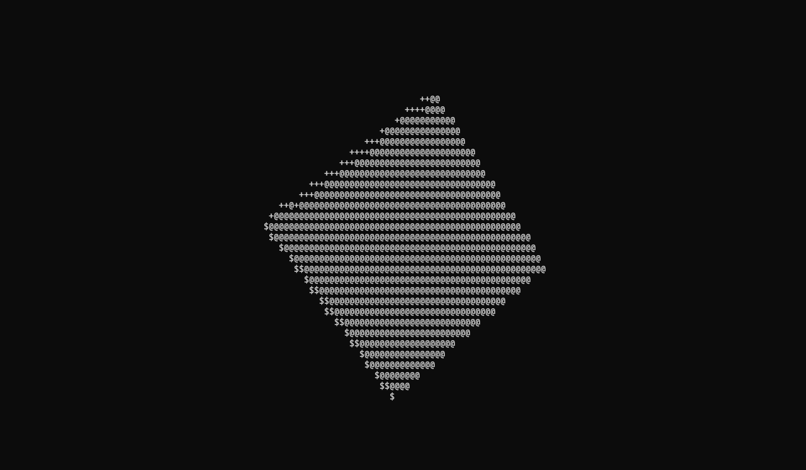

# `cube.rs`

This is a simple reimplementation of Servet Gulnaroglu's ([@servetgulnaroglu](https://github.com/servetgulnaroglu)) `cube.c` program.

You can see the repository with the original source code [here](https://github.com/servetgulnaroglu/cube.c), or watch the YouTube video where he coded it [here](https://youtu.be/p09i_hoFdd0).

## Running `cube.rs`

Despite the tongue-and-cheek name of the repository, the actual project runs from a `main.rs` file like any regular Rust project created from running `cargo new`. Running the code is as simple as downloading the repository, navigating to the project folder in a terminal, and running `cargo run`. You may need to resize your terminal to fit the animation. To quit the animation, just use `ctrl + c` to end the program.

I've included some sample animations in the repository, located in `samples.rs`. By default, the program runs the simple example, which features a single cube spinning in the center of the frame. You can edit `main.rs` to run one of the other sample animations, but just be aware that since each animation runs an infinite loop, multiple function calls to sample animations inside the `main()` function will have no effect, as only the first one will run.

## License

I am unaware of any licenses on the original `cube.c` code. Therefore, since I firmly believe that choosing **any** license is better than having no license at all, I have chosen to follow much of the Rust community and license this work under the dual MIT / Apache-2.0 license. If it comes to my attention that the original work is licensed in some way, I'll reevaluate this section and update it as appropriate.

Licensed under either of

 * Apache License, Version 2.0, ([LICENSE-APACHE](LICENSE-APACHE) or http://www.apache.org/licenses/LICENSE-2.0)
 * MIT license ([LICENSE-MIT](LICENSE-MIT) or http://opensource.org/licenses/MIT)

at your option.

## Contribution

Unless you explicitly state otherwise, any contribution intentionally submitted for inclusion in the work by you, as defined in the Apache-2.0 license, shall be dual licensed as above, without any additional terms or conditions.